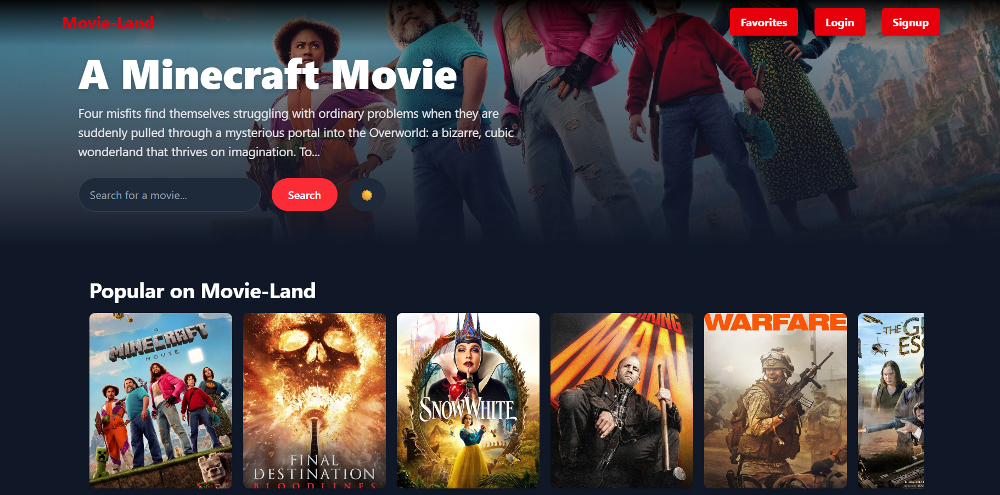
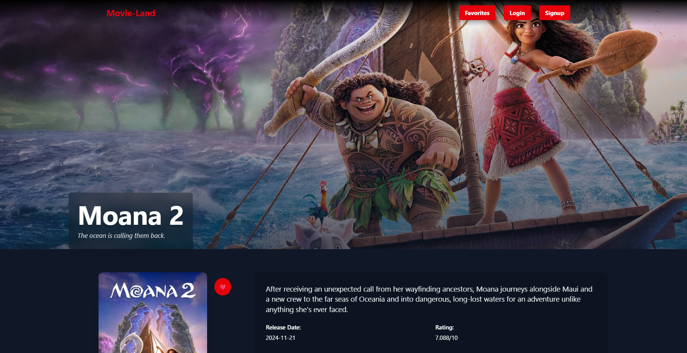
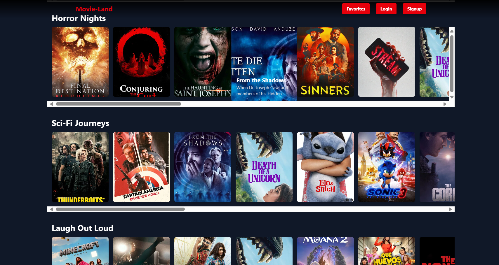
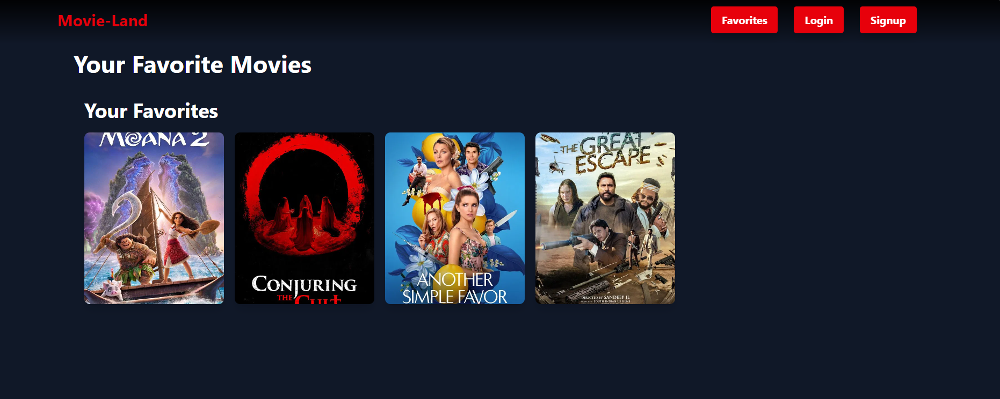

# 🎥 Movie-Land - A  React-Based Movie Browser

This is a movie browsing app crafted with **React**, **Tailwind CSS**, and **Framer Motion**. It pulls real-time movie data from the **TMDB API**, offering an immersive experience similar to Netflix.
.
## ✨ Key Highlights

🎞️ Discover movies across multiple genres including Horror, Sci-Fi, Comedy, and more

🔍 Quickly find any movie with integrated TMDB-powered search

🌓 Personalize your viewing with light and dark mode support

💫 Experience elegant, animated UI transitions via Framer Motion

🧱 Built with clean architecture and reusable component design

## 📸 Preview

## 🛠️ Tech Stack

- React
- Tailwind CSS
- Framer Motion
- TMDB API
